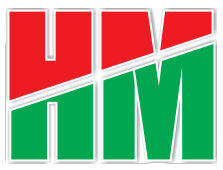

<html lang="en">
<head>
  <meta charset="UTF-8">
  <meta name="viewport" content="width=device-width, initial-scale=1.0">
  <title>HM Solutions & Co. - Software Hub</title>
  <link rel="icon" type="image/png" href="images/company.logo.png">
  
</head>
<body>

  <!-- HEADER -->
  <header>
    

      
      <h1>HM Solutions & Co. (RC: 8641426)</h1>
    

    <nav>
      <ul>
        <li><a href="#">Home</a></li>
        <li>
          <a href="#">Downloads ▾</a>
          <ul>
            <li><a href="#Featured Software">Promotion Guide</a></li>
            <li><a href="#Pending Projects">Other Software (Coming Soon)</a></li>
          </ul>
        </li>
      </ul>
    </nav>
  </header>

  <!-- HERO -->
  <section class="hero">
    <h2>Welcome to HM Solutions & Co.</h2>
    

      We specialize in developing innovative and practical software solutions tailored for training 
      public servants (Promotion Exam), students (UTME), Job seekers (Aptitude Test) and professional training. Explore our ready-to-use applications 
      and upcoming projects designed to simplify work and improve productivity.
    

  </section>

  <!-- FEATURED SOFTWARE -->
  <section class="section">
    <h3>Featured Software</h3>
    

      <h4>Promotion Guide   This is CBT Training Software for public servants preparing for promotion exam.</h4>
      

        Version: <strong>1.0.3</strong>  
        📦 File Size: <strong>234 MB</strong>  
        ⚙️ Format: <strong>Windows Setup (.exe)</strong>
      

      <a class="btn-download" href="https://drive.google.com/uc?export=download&id=1Hs7aHPHAP1TBVVqYOeBSyJuLMFO-MgD5">
        ⬇ Download Now
      </a>
    

  </section>

  <!-- PENDING PROJECTS -->
  <section class="section">
    <h3>Pending Projects</h3>
    

      <h4>CHEW/JCHEW National Exam Training App</h4>
      
📌 Status: Development in progress

    

    

      <h4>Unified Tertiary Matriculation Examination (UTME-JAMB)</h4>
      
📌 Status: Coming soon

    

  </section>

  <!-- FOOTER -->
  <footer>
    

      <a href="mailto:hmsolutionsltd3@gmail.com">Email</a>|
      <a href="https://web.facebook.com/HMTelecoms" target="_blank">Facebook</a>|
      <a href="https://wa.me/+2348053579779" target="_blank">WhatsApp</a>|
      <a href="https://x.com/HMusa3" target="_blank">Twitter</a>|
      <a href="https://www.instagram.com/hmtelecoms0/" target="_blank">Instagram</a>|
      <a href="https://www.linkedin.com/in/hussaini-musa-68614283/" target="_blank">LinkedIn</a>
    

    
📍 Address: Abuja, FCT, Nigeria

    
© 2024 HM Solutions & Co. All rights reserved.

  </footer>

</body>
</html>
